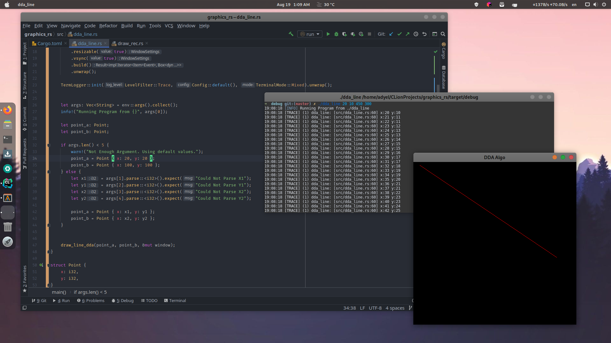

# Computer Graphics
CSE423: Computer Graphics Course

Tried some of the basic graphics drawing using Rust. Currently wrote only Rectange, DDA Line, Midpoint Line, Midpoint Circle.

## Just Rectangle

Drawn using build in line drawing method. This was used to get idea about the location are orientation of the drawing.

## DDA Line

Line drawn using DDA algoritm.

## Midpoint Line

Line Drawn using Mid Point Algorithm

